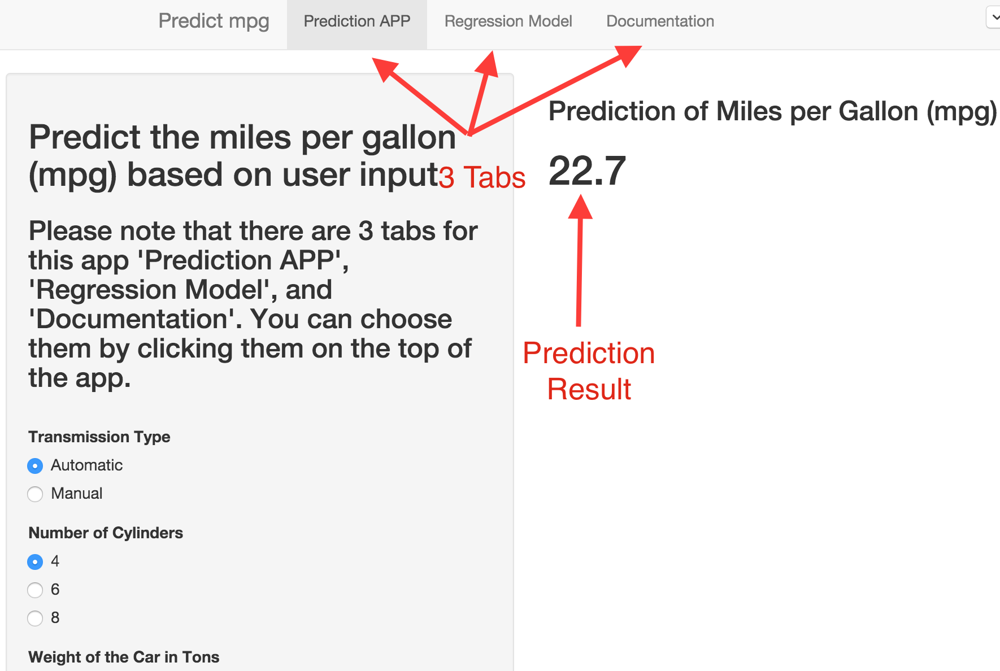

Predict the miles per gallon (mpg) based on user input
========================================================
author: Cheng Nie
date: 2015-12-24

Purpose of This APP
========================================================

This APP can predict the miles per gallon (mpg) based on user input of the following 3 items. 

- Transmission Type
- Number of Cylinders
- Weight of the Car in Tons


How to Use This APP
========================================================

This APP has three tabs 

- Prediction APP
    - Predict the mpg based on the user input of 3 items
- Regression Model
    - The linear regression model used to predict the mpg
    - The data to fit the model is from the `mtcars`
- Documentation
    - The readme.md markdown file to explain the APP

Screenshot Explanation of the Three Tabs
========================================================


Linear Regression Model
========================================================


```r
library(xtable)
data(mtcars)

mtcars$am <- as.numeric(mtcars$am)
mtcars$cyl <- as.factor(mtcars$cyl)
fit <- lm(mpg ~ am + wt + cyl, data = mtcars )
summary(fit)$coef[,c(1,4)]
```

```
              Estimate     Pr(>|t|)
(Intercept) 33.7535920 2.495549e-12
am           0.1501031 9.089474e-01
wt          -3.1495978 1.770987e-03
cyl6        -4.2573185 5.514697e-03
cyl8        -6.0791189 1.227964e-03
```

